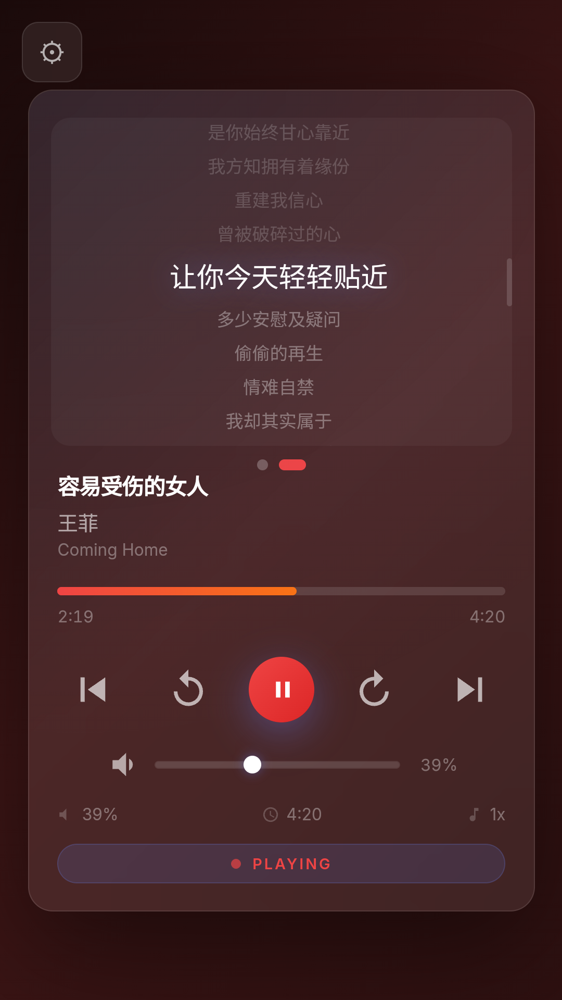
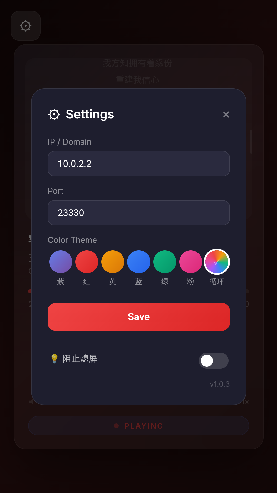
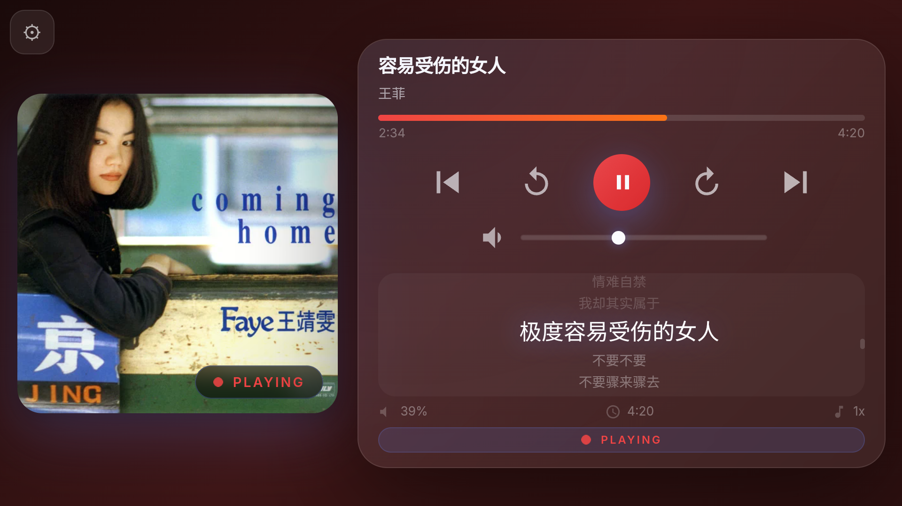

# LX Music LyricsBuddy 🎵

LX Music 歌词小助手 — 一个轻量级歌词同步客户端，连接 LX Music 桌面端 API。

## ✨ 功能

- 🎤 实时歌词同步（LRC 解析 + 自动滚动 + 防抖优化）
- 🎨 5 种主题（薰衣草紫、樱花粉、薄荷绿、深空灰、珊瑚橙）
- 📱 响应式布局（手机竖屏/横屏、平板竖屏/横屏、桌面端）
- 🖼️ 专辑封面展示
- ⏯️ 播放控制（播放/暂停/上下首/快进快退/进度拖拽/音量）
- 📲 PWA 支持，可添加到主屏幕
- 🤖 Android 原生 APK（WebView 封装）
- 🔄 SSE + 轮询双通道自动降级

## 🚀 快速开始

### 网页版

```bash
npm install
npm run dev
# 浏览器打开 http://localhost:5173
# 在设置里填入 LX Music API 地址（默认 localhost:23330）
```

### 构建生产版本

```bash
npm run build
# 输出到 dist/
```

### Android APK

```bash
npm run build
npx cap sync android
cd android && ./gradlew assembleDebug
# APK 在 android/app/build/outputs/apk/debug/
```

## ⚙️ 配置

在 App 设置界面或 URL 参数中配置 API 地址：

```
http://localhost:5173/?host=192.168.1.100&port=23330&theme=lavender
```

## 📡 API 依赖

需要 LX Music 桌面端开启 API 服务（默认端口 23330）。

| 端点 | 用途 |
|------|------|
| `GET /status` | 播放状态 |
| `GET /subscribe-player-status` | SSE 实时事件流 |
| `GET /lyric` | 歌词文本 |
| `GET /play` `/pause` `/skip-next` `/skip-prev` | 播放控制 |
| `GET /seek?offset=N` | 进度跳转 |
| `GET /volume?volume=N` | 音量调节 |

## 📸 截图

| 手机竖屏 | 手机横屏 | 平板竖屏 |
|---------|---------|----------|
|  |  |  |

## 📝 更新日志

### v1.0.3 (2026-05-09)

- 🚀 SSE + 轮询状态机，消除重复请求和定时器泄漏
- 🚀 歌词缓存（Map），切歌不再重复解析
- 🚀 进度定时器降频 250ms → 500ms
- 🎨 歌词滚动 100ms 防抖，只滚动当前可见区域
- 🎨 按钮触摸反馈优化（active-only，无 hover 残留）
- 🎨 歌词高亮字号统一放大
- 🎨 响应式断点优化（500px 分界），平板竖屏/横屏完整适配
- 🎨 CSS backdrop-filter 降级（prefers-reduced-motion）
- 🎨 Google Fonts 预加载，移除 @import 阻塞
- 🐛 弹窗横屏显示不全（max-height + overflow）
- 🐛 音量条样式修复（track 伪元素 + 滑块球放大）
- 🗑️ 移除专辑名称 "Album: " 前缀

### v1.0.2 (2026-05-09)

- 响应式布局优化
- 平板模式支持

### v1.0.1

- 初始版本

## 📄 License

MIT
